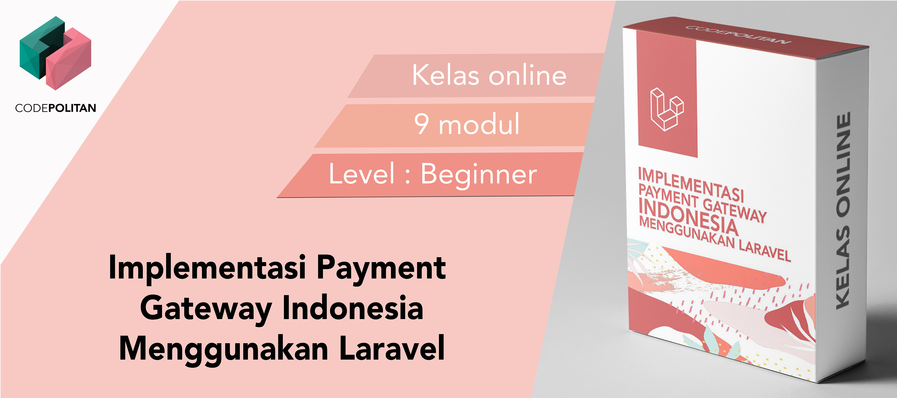

# Implementasi Payment Gateway Indonesia Menggunakan Laravel

Repositori ini berisi source code aplikasi web berbasis Laravel yang mengimplementasikan sistem pembayaran online Indonesia yaitu Midtrans. Untuk belajar bagaimana membuat aplikasi web yang dapat menerima dan memverifikasi pembayaran secara otomatis seperti ini kamu bisa pelajari lewat kelas [Implementasi Payment Gateway Indonesia Menggunakan Laravel](https://www.codepolitan.com/course/intro/payment-gateway-laravel).
